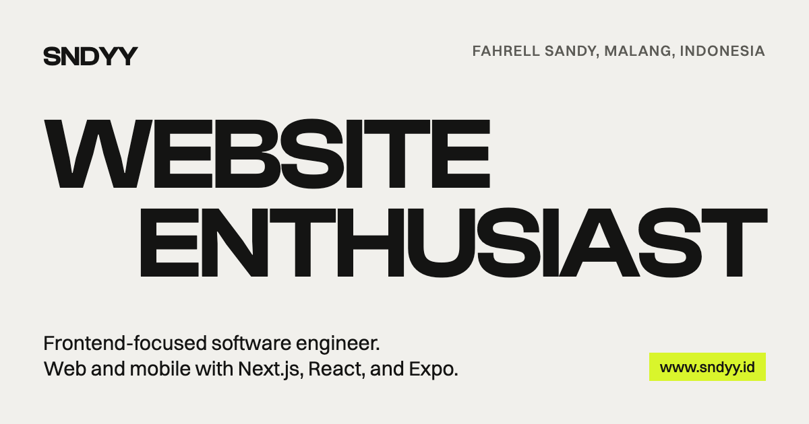

<div align="center">

# SNDYY

**The portfolio of Fahrell Sandy, website enthusiast.**

Frontend-focused software engineer building web and mobile products with Next.js, React, and Expo.

[www.sndyy.id](https://www.sndyy.id) · [LinkedIn](https://www.linkedin.com/in/fahrell-sandy/) · [Resume](https://www.sndyy.id/resume.pdf)



</div>

## About the site

This is a one-page portfolio built as a playground. The type, the grid, and the scroll are the toys, and every section has one interaction of its own.

| Section | What it does |
| --- | --- |
| **Hero** | Letter weights follow the cursor on Clash Display's variable axis. WEBSITE types itself into MOBILE on a loop. Pressing the photo tile selects and retypes the headline into SKETCH & ILLUSTRATE, and the site accent turns from lime to rose red. |
| **Strip** | "WEBSITE / MOBILE ENTHUSIAST" rides a curve across the seam from light to dark, scrubbed by scroll. |
| **About** | The statement brightens word by word as it scrolls past the middle of the screen. |
| **What I do** | A keyboard-friendly accordion with a cursor-following preview image. |
| **Evidence** | Six projects as colored cards that stick and stack as you scroll. |
| **More evidence** | Verified certificates on a band that moves only when you scroll. |
| **Experience** | A giant year pinned to the middle of the screen that flips as each role passes it. |
| **Footer** | LET'S TALK. rolls into LET'S LARP. when pressed, and the nav button follows. |

Every animation respects `prefers-reduced-motion`, the whole page works with a keyboard, and all text meets WCAG AA contrast.

## Tech stack

| Area | Choice |
| --- | --- |
| Framework | [Next.js 16](https://nextjs.org) (App Router, every route prerendered as static), React 19 with the React Compiler |
| Styling | [Tailwind CSS v4](https://tailwindcss.com) with design tokens in `app/globals.css` |
| Motion | [Motion](https://motion.dev) for UI interaction, [GSAP](https://gsap.com) ScrollTrigger for scroll scenes, [Lenis](https://lenis.darkroom.engineering) for smooth scroll |
| Type | Clash Display and Switzer from [Fontshare](https://www.fontshare.com), self-hosted |
| Language | TypeScript |
| Package manager | [Bun](https://bun.sh) |

## Getting started

You need [Bun](https://bun.sh) 1.3 or newer. Node 18 or newer also works for the font script.

```bash
git clone https://github.com/Phiniqq724/portfolio.git
cd portfolio
bun install
bun run dev
```

Open [http://localhost:3000](http://localhost:3000).

The first `dev` or `build` downloads the fonts from Fontshare into `app/fonts/`. They are not stored in this repository because their license does not allow it. See [Fonts](#fonts).

### Scripts

| Command | What it does |
| --- | --- |
| `bun run dev` | Downloads the fonts if missing, then starts the dev server |
| `bun run build` | Downloads the fonts if missing, then builds for production |
| `bun run start` | Serves the production build |
| `bun run lint` | Runs ESLint |
| `bun run fonts` | Downloads the fonts on their own |

## Project structure

```
app/
  layout.tsx            Metadata, structured data, fonts, smooth scroll
  page.tsx              Section order
  globals.css           Design tokens, tones, accents
  sitemap.ts            /sitemap.xml
  robots.ts             /robots.txt
  manifest.ts           /manifest.webmanifest
  favicon.ico, icon.png, apple-icon.png, opengraph-image.png, twitter-image.png
components/
  sections/             Nav, Hero, Strip, About, WhatIDo, Evidence, Certificates, Experience, Footer
  ui/                   Container, Corners, Reveal, SmoothScroll, ServiceAccordion, FooterHeadline
content/
  site.ts               Every visible string, link, project, and role
lib/
  gsap.ts               GSAP and ScrollTrigger registration
  larp.ts               Shared state for the footer and nav LARP toggle
public/
  images/               Personal photos (see images/README.md)
  resume.pdf
scripts/
  fonts.mjs             Fontshare font download
DESIGN.md               Design spec and every decision made while building
```

## Editing content

- **Text, links, projects, roles, certificates:** everything visible lives in [`content/site.ts`](content/site.ts). No copy is hardcoded in components.
- **Photos:** replace the files in [`public/images/`](public/images/) and keep the file names. The layout reads each image's real size, so nothing gets cropped. [`public/images/README.md`](public/images/README.md) lists where each photo appears.
- **Resume:** replace `public/resume.pdf`.
- **Design rules:** [`DESIGN.md`](DESIGN.md) records the tokens, the section specs, and the reasons behind each choice. Read it before changing layout or motion.

## SEO

- Title, description, canonical URL, Open Graph, and Twitter card metadata in `app/layout.tsx`
- JSON-LD `ProfilePage` and `Person` structured data
- Sitemap, robots rules, web app manifest, and icons generated from the App Router file conventions

Lighthouse on the production build:

| | Performance | Accessibility | Best practices | SEO |
| --- | --- | --- | --- | --- |
| Desktop | 100 | 100 | 100 | 100 |
| Mobile | 94 | 100 | 100 | 100 |

## Deployment

The site is built for [Vercel](https://vercel.com). Import the repository, keep the detected Bun settings, and deploy. The `prebuild` script fetches the fonts during the build.

After the first deploy to `www.sndyy.id`, submit `https://www.sndyy.id/sitemap.xml` in Google Search Console. The canonical host is `www.sndyy.id`; the bare `sndyy.id` should redirect to it.

## Fonts

[Clash Display](https://www.fontshare.com/fonts/clash-display) and [Switzer](https://www.fontshare.com/fonts/switzer) are designed by Indian Type Foundry and licensed under the ITF Free Font License. The license allows self-hosting them on your own website but forbids redistributing the font files, including through a repository. That is why `app/fonts/*.woff2` is git-ignored and [`scripts/fonts.mjs`](scripts/fonts.mjs) downloads them from Fontshare. By running the script you accept that license.

## License

The **source code** is released under the [MIT License](LICENSE).

The **personal content** is not: photos, illustrations, the resume, the written copy, the SNDYY wordmark, and the icons and share images are all rights reserved. [`NOTICE.md`](NOTICE.md) lists exactly what is excluded. If you fork this project, replace that content with your own.

## Credits

Inspired by [nbnzia.com](https://www.nbnzia.com), [brilean.com](https://www.brilean.com), [okaydev.co](https://okaydev.co), and [haoqi.design](https://haoqi.design).
